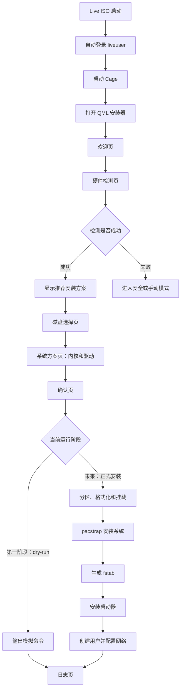

# MeoArch OS Installer Specification

## 1. 项目目标

MeoArch OS Installer 是运行在 MeoArch OS Live ISO 中的图形安装器。

项目当前确定的系统基线：

- 上游基础：Arch Linux
- 默认启动器：GRUB
- 默认桌面：经过 MeoArch 定制的 KDE Plasma
- 系统软件：KDE/Arch 软件与一部分 MeoArch 自有软件组合
- 第一阶段显卡驱动支持：NVIDIA
- 后续显卡支持：AMD、Intel 及其他设备；现在保留检测和驱动规则接口，但不承诺完整安装支持

目标体验接近 Chromebook 恢复/安装环境：启动后直接进入简洁、全屏、专注的安装界面，不先暴露传统桌面。

核心启动路径：

```text
Live ISO 启动
  -> 自动登录 liveuser
  -> 启动 Cage Wayland kiosk
  -> 全屏运行 Qt 6/QML 安装器
  -> 检测硬件并生成推荐方案
  -> 用户确认安装方案
  -> 安装后端执行安装步骤
```

第一阶段只实现 **dry-run（模拟安装）**。不得执行真实分区、格式化、挂载或 `pacstrap`。

## 2. 技术栈

- Archiso：构建 MeoArch OS Live ISO
- Cage：提供单应用 Wayland kiosk 环境
- Qt 6 + QML：安装器界面
- C++/Qt 后端：连接 QML 与系统检测、方案生成脚本
- Shell 脚本：硬件检测、包列表生成和后续安装操作
- JSON：脚本与 C++/QML 之间的数据交换格式
- MeoUI：安装器的 Material Design 3 组件与主题基础
- KDE Plasma：目标系统默认桌面，使用 MeoArch 定制版本
- GRUB：目标系统默认启动器

### 2.1 界面设计规范

所有安装器页面和 MeoUI 组件必须参考 [Material Design 3](https://m3.material.io/)，并以 **Material Design 3 Expressive（MD3E）** 作为统一视觉与交互方向。

必须统一考虑：

- MD3E 色彩角色与动态颜色体系
- 排版层级
- Expressive shape 与圆角体系
- 容器、卡片及 surface 层级
- 按钮、选择控件、导航和进度反馈
- hover、pressed、focus、disabled 等状态层
- 动效、缓动和页面转场
- 键盘操作、可读性、对比度及无障碍
- 不同分辨率与缩放比例下的自适应布局

后续 Figma 截图作为页面构图和美学设计依据，但实现仍需保持 MD3E 语义、状态和可访问性。若 Figma 与既定功能流程冲突，应先确认，不得自行改动流程。

## 3. 安装器流程



正式安装分支只用于描述最终方向，第一阶段不可从界面触发。

## 4. 页面定义

安装器第一版固定为 6 个页面，通过 QML `StackView` 切换。

### 4.1 欢迎页（WelcomePage）

作用：安装器入口。

内容：

- 标题：欢迎使用 MeoArch OS 安装器
- 说明：这是一个基于 Arch Linux 的自定义系统安装环境
- 开始安装
- 进入终端
- 关机

待确定：进入终端后是暂时隐藏安装器、打开嵌入式终端，还是切换到其他 TTY。

### 4.2 硬件检测页（HardwarePage）

作用：检测并展示机器基本信息。

展示字段：

- CPU：厂商与型号
- GPU：允许显示多个设备，例如 Intel 核显 + NVIDIA 独显
- 启动模式：UEFI 或 BIOS
- 内存：总容量
- 网络：已连接或未连接
- 磁盘：设备路径、型号、容量

操作：

- 重新检测
- 下一步
- 检测失败时进入安全/手动模式

### 4.3 磁盘选择页（DiskPage）

作用：选择未来的目标磁盘。

第一阶段只展示和选择，不分区、不格式化。

展示字段：

- 设备路径，例如 `/dev/nvme0n1`、`/dev/sda`
- 容量
- 型号
- 是否可能为当前系统盘
- 是否为只读或可移动设备（如果能够可靠检测）

操作：

- 刷新
- 选择磁盘
- 下一步

待确定：正式安装阶段的自动分区布局、文件系统、加密和双系统策略。

### 4.4 系统方案页（PlanPage）

作用：根据硬件展示推荐的内核、显卡驱动和 CPU 微码。

内核选项：

- `linux`
- `linux-lts`
- `linux-zen`

方案内容：

- 显卡驱动推荐
- CPU 微码推荐：`intel-ucode` 或 `amd-ucode`
- 默认桌面：MeoArch 定制 KDE Plasma
- 最终软件包列表
- 推荐理由或兼容性提示

操作：

- 使用推荐
- 高级设置
- 下一步

检测数据结构必须支持混合显卡，不能假设一台机器只有一个 GPU。第一阶段只实现 NVIDIA 的完整推荐和安装包规则；AMD、Intel 及其他 GPU 必须能被识别和展示，并返回“尚未支持”状态，驱动安装规则留待后续实现。

第一阶段不提供桌面环境选择；目标系统固定使用 MeoArch 定制 KDE Plasma。其具体包组和自有软件清单待后续补充。

### 4.5 确认页（ConfirmPage）

作用：在执行前完整展示安装方案与计划命令。

展示内容示例：

```text
目标磁盘：/dev/nvme0n1

计划安装的软件包：
base linux linux-firmware amd-ucode mesa nvidia-open nvidia-utils
networkmanager sudo grub efibootmgr

计划步骤：
pacstrap /mnt ...
genfstab ...
grub-install ...
```

第一阶段唯一安装操作按钮：

- 模拟安装

第一阶段不得提供“正式安装”按钮。

### 4.6 日志页（LogPage）

作用：实时显示检测、方案生成和 dry-run 输出。

输出示例：

```text
[OK] 检测硬件完成
[OK] 生成安装方案
[DRY-RUN] pacstrap /mnt base linux ...
[DRY-RUN] genfstab -U /mnt
[DRY-RUN] grub-install ...
```

日志至少区分：

- `[OK]`：步骤成功
- `[INFO]`：普通信息
- `[WARN]`：非致命问题
- `[ERROR]`：步骤失败
- `[DRY-RUN]`：只展示、未执行的命令

## 5. 后端边界

QML 只负责：

- 展示数据
- 页面导航
- 接收用户选择
- 发出检测、生成方案和 dry-run 请求
- 显示后端状态与日志

QML 不应直接：

- 解析 `lspci`、`lscpu` 等命令文本
- 拼接 shell 命令
- 执行分区或安装命令
- 决定驱动兼容规则

C++/Qt 后端负责：

- 安全地启动检测和方案脚本
- 解析并验证 JSON
- 将结构化数据暴露给 QML
- 管理异步状态、错误和日志
- 在未来控制安装进程

Shell 脚本负责：

- 收集底层系统信息
- 根据规则生成目标系统包列表
- 第一阶段输出 dry-run 命令
- 未来执行经过明确授权的安装步骤

## 6. 硬件检测接口

建议脚本路径：

```text
/usr/local/lib/meo-installer/detect-hardware.sh
```

要求：

- 标准输出只能输出一个有效 JSON 对象
- 诊断信息写入标准错误
- 成功返回退出码 `0`
- 无法完成可靠检测时返回非零退出码
- 多显卡必须作为数组返回
- 磁盘列表不能混入分区
- 脚本必须进行真实系统检测，不得以固定假数据代替
- 第一阶段必须识别 NVIDIA、AMD、Intel 和未知 GPU；其中只有 NVIDIA 标记为完整驱动支持

建议输出结构：

```json
{
  "schemaVersion": 1,
  "success": true,
  "cpu": {
    "vendor": "AuthenticAMD",
    "model": "AMD Ryzen ..."
  },
  "gpus": [
    {
      "vendorId": "1002",
      "vendor": "AMD",
      "model": "...",
      "pciAddress": "0000:05:00.0",
      "supportStatus": "detected-only"
    }
  ],
  "bootMode": "uefi",
  "memoryBytes": 17179869184,
  "network": {
    "connected": true
  },
  "disks": [
    {
      "path": "/dev/nvme0n1",
      "model": "...",
      "sizeBytes": 1000204886016,
      "removable": false,
      "readOnly": false
    }
  ],
  "warnings": []
}
```

## 7. 安装方案接口

建议脚本路径：

```text
/usr/local/lib/meo-installer/generate-plan.sh
```

输入应使用 JSON 或明确的命令行参数，不能依赖解析界面文字。至少包含：

- 硬件检测结果
- 用户选择的内核
- 用户选择的目标磁盘
- 是否使用自动推荐

输出应为结构化 JSON：

```json
{
  "schemaVersion": 1,
  "success": true,
  "kernel": "linux",
  "microcodePackages": ["amd-ucode"],
  "gpuPackages": ["mesa", "vulkan-radeon", "libva-mesa-driver"],
  "basePackages": [
    "base",
    "linux-firmware",
    "networkmanager",
    "sudo",
    "grub",
    "efibootmgr"
  ],
  "finalPackages": [
    "base",
    "linux",
    "linux-firmware",
    "amd-ucode",
    "mesa",
    "vulkan-radeon",
    "libva-mesa-driver",
    "networkmanager",
    "sudo",
    "grub",
    "efibootmgr"
  ],
  "plannedCommands": [
    "pacstrap /mnt ...",
    "genfstab -U /mnt",
    "grub-install ..."
  ],
  "warnings": []
}
```

`finalPackages` 必须去重。显卡规则应逐个处理所有 GPU，然后合并所需软件包。

第一阶段 NVIDIA 规则必须根据显卡型号和所选内核生成对应方案。AMD、Intel 与未知 GPU 暂时只输出检测信息、明确警告和可扩展的规则标识，不得假装已经完成驱动支持。

目标系统方案必须包含：

- GRUB
- MeoArch 定制 KDE Plasma 的包组
- 已确定的 MeoArch 自有软件包

KDE 包组及自有软件的准确包名尚未确定，未确认前不得臆造。

## 8. 第一阶段 dry-run 约束

第一阶段允许：

- 读取硬件信息
- 读取磁盘信息
- 检测网络状态
- 生成推荐方案
- 生成和展示计划命令
- 写入安装器自身的临时日志

第一阶段禁止：

- 修改分区表
- 格式化文件系统
- 挂载目标磁盘用于安装
- 执行 `pacstrap`
- 生成或覆盖真实系统的 `fstab`
- 执行 `grub-install`
- 创建真实目标用户
- 改动本机固件启动项

后端应从设计上区分“生成命令”和“执行命令”，不能只靠 QML 隐藏正式安装按钮。

## 9. Live ISO 图形环境

Live 环境目标不是最小化，而是优先保证 QML 安装器流畅启动。

计划依赖：

```text
# Wayland kiosk
cage

# 图形基础
mesa
libglvnd
vulkan-icd-loader
vulkan-radeon
vulkan-intel

# NVIDIA Live 支持候选
nvidia-open
nvidia-utils
nvidia-settings

# Qt 6 / QML
qt6-base
qt6-declarative
qt6-wayland
qt6-svg
qt6-imageformats

# 字体
noto-fonts
noto-fonts-cjk
ttf-dejavu

# 安装工具
arch-install-scripts
parted
gptfdisk
dosfstools
e2fsprogs
btrfs-progs
xfsprogs
efibootmgr
grub
networkmanager
sudo
```

说明：Live ISO 中包含的驱动与最终目标系统安装的驱动是两套独立包列表。Live 环境可以为兼容性预装较厚的图形栈；目标系统必须根据检测结果选择驱动。

第一阶段以 NVIDIA 机器作为完整支持和测试目标。Live ISO 是否同时预装 AMD/Intel 图形用户态包，可根据 Cage/QML 启动兼容性保留；这不代表目标系统已经提供 AMD/Intel 的正式驱动安装支持。

NVIDIA Live 支持范围、旧显卡后备方案和 `nvidia-settings` 是否保留，仍需实机验证后确定。

## 10. 普通模式与安全模式

普通模式目标：

```text
Cage + Wayland + Qt Quick 硬件渲染
```

安全模式目标：

```text
Cage 或其他后备显示路径 + Qt Quick 软件渲染
```

Qt 软件渲染候选环境变量：

```bash
export QT_QPA_PLATFORM=wayland
export QT_QUICK_BACKEND=software
export QSG_RHI_BACKEND=software
```

注意：这些变量只处理 Qt Quick 渲染。若 Cage 无法初始化 DRM/GPU，它们不足以保证安装器出现。因此 Cage 的软件渲染方式或其他显示后备路径需要单独设计和测试。

安全模式的入口暂定为启动菜单选项或普通模式失败后的明确回退；最终策略待确定。

## 11. 建议的实现任务顺序

1. 创建 Qt 6/QML 安装器骨架和六个空页面，使用 `StackView` 导航。
2. 实现真实可运行的 `detect-hardware.sh`，从当前机器采集数据并输出符合版本化接口的 JSON；不得停留在接口占位或模拟数据。
3. 实现 C++/Qt 后端，异步调用检测脚本并向 QML 暴露结果。
4. 实现 `generate-plan.sh`：第一阶段完成 NVIDIA、CPU 和所选内核规则；同时为 AMD、Intel 和未知 GPU 保留版本化规则接口并返回明确状态。
5. 实现确认页和严格不可执行真实命令的 dry-run 后端。
6. 实现日志页和错误状态。
7. 将安装器、运行依赖和启动脚本接入 Archiso `airootfs`。
8. 在虚拟机及 Intel、AMD、NVIDIA、混合显卡设备上验证普通模式和安全模式。
9. 在 dry-run 结果稳定后，另行设计正式安装执行器。

## 12. 尚未确定的事项

以下内容不得在没有进一步设计或确认时擅自实现：

- 自动分区布局
- 默认文件系统
- 全盘加密
- 双系统安装策略
- MeoArch 定制 KDE Plasma 的准确包组
- MeoArch 自有软件清单及软件包来源
- 用户创建表单与权限策略
- GRUB 在 BIOS 和 UEFI 下的具体安装参数
- Secure Boot
- NVIDIA 旧显卡支持范围
- AMD、Intel 及其他 GPU 的正式驱动安装规则
- Cage 无法启动时的最终后备显示方案
- 网络断开时的安装策略
- 正式安装的授权、确认和失败回滚机制
